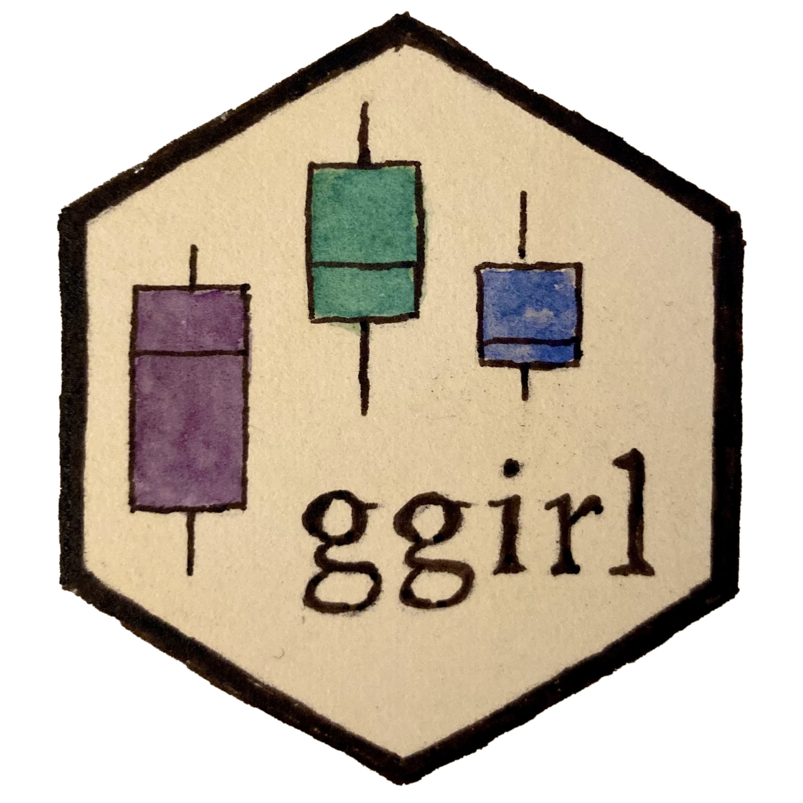
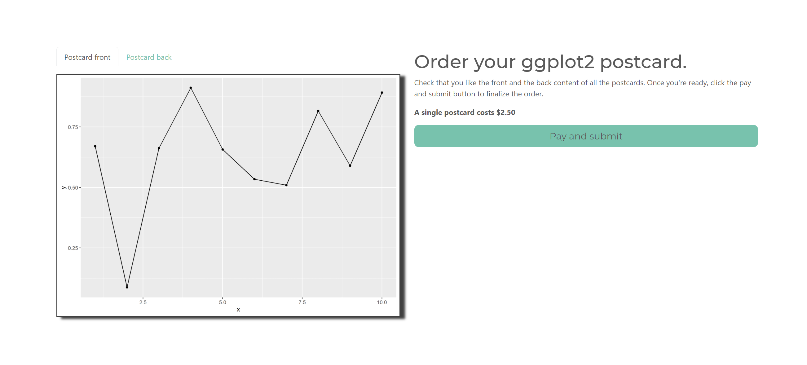
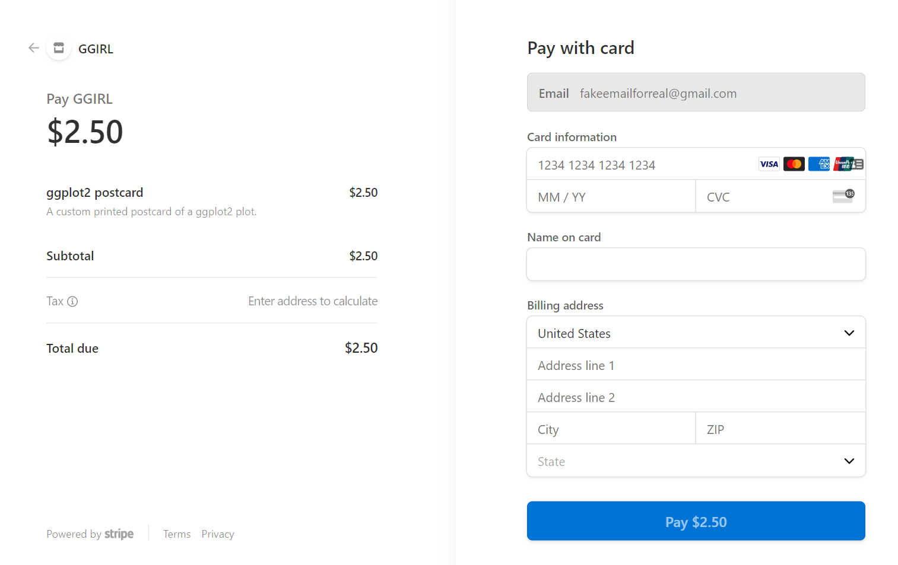
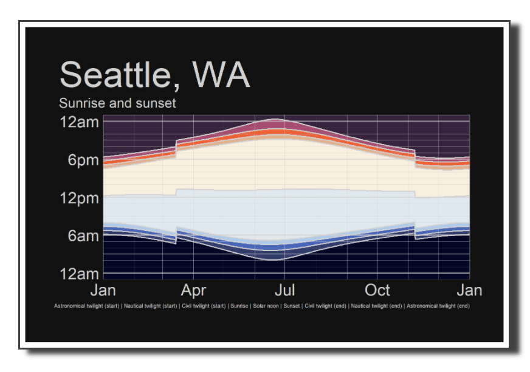

# ggirl - make ggplots in real life 

_need support? Email [support@ggirl.art](mailto:support@ggirl.art)_

This package is a platform for taking ggplot2 objects and getting real life versions of them. Tired of saving your plots with the plain 'ol `ggsave()` function? Try this package instead!

The mediums in this package that you can choose from will change over time. Currently available is...

## ggpostcard

`ggpostcard()` will take your ggplot2 object and _**will mail a postcard with it to the address of your choice!**_ Great for friends and colleagues (or maybe holiday cards??). You can specify a single address or many addresses to mail to, and you can customize the message on the back. If you send postcards to many people, you can customize the backs for each recipient if you so chose. _Each postcard costs $2.50 to send._

### How to make a postcard

First, install the package with:

```r
# install.packages("remotes") # if you don't already have it
remotes::install_github("jnolis/ggirl")
```

Then create a plot you like:

```r
library(ggplot2)
plot <- ggplot(data.frame(x=1:10, y=runif(10)),aes(x=x,y=y)) + geom_line() + geom_point()
```

Now let's ship it! Specify your email address (for order updates), address to mail to, and the message to put on the back:

```r
library(ggirl)
contact_email <- "fakeemailforreal@gmail.com"

send_address_1 <- address(name = "Fake Personname", address_line_1 = "250 North Ave",
                          city = "Boston", state = "MA",
                          postal_code = "22222", country = "US")

message_1 <- "This plot made me think of you!"

ggpostcard(plot, contact_email, messages = message_1, send_addresses = send_address_1)
```

_(You can include multiple recipients too and customize the return address--check out the function help for more details.)_

This will pop up a web page showing you what the order will look like. If both the front picture and back info look good to you click the button to make the payment and submit the order.



This will bring you to Stripe to finish the purchase.



And you're done! Postcards will arrive in 5-7 business days.

### Examples for if you can't think of a cool postcard plot 

#### Sunrise/sunset plot

You can use `ggirl::ggpostcard_example_sunrise(...)` to make a postcard of sunrise and sunset locations for a city. You'll need the latitude, longitude, and time zone for the location, and it takes a minute or so to query the [sunrise/sunset api](https://sunrise-sunset.org/api):



```r
library(ggirl)
location_lat <- 47.6062
location_long <- -122.3321
location_tz <- "America/Los_Angeles"
location_name <- "Seattle, WA"
return_address <- address(name = "Jacqueline Nolis", address_line_1 = "111 North St",
                          city = "Seattle", state = "WA",
                          postal_code = "11111", country = "US")
contact_email <- "fakeemailforreal@gmail.com"
send_addresses <- address(name = "Fake Personname", address_line_1 = "250 North Ave",
                          city = "Boston", state = "MA",
                          postal_code = "22222", country = "US")
messages <- "Look at this cool plot I found!"
ggpostcard_example_sunrise(location_lat, location_long, location_tz, location_name,
                           contact_email = contact_email, return_address = return_address,
                           send_addresses = send_addresses, messages = messages)
```

## Get involved

If you think this package is interesting you can help in multiple ways! Maybe you have an R package that could call one of these functions! Maybe you could come up with a new form of fulfillment, like making plots out of clay! Email info@ggirl.art to discuss it.

## Acknowledgments

Thanks to:

* [@nolistic](https://github.com/nolistic) and [@robinsones](https://github.com/robinsones) for helping design the product.
* The beta testers: [@cxinya](https://github.com/cxinya), [@delabj](https://github.com/delabj), [@thisisnic](https://github.com/thisisnic), [@TheCoachEdwards](https://github.com/TheCoachEdwards), [@ryantimpe](https://github.com/ryantimpe), [@robinsones](https://github.com/robinsones), [@mcsiple](https://github.com/mcsiple), and [@cathblatter](https://github.com/cathblatter).
* [@ColinFay](https://github.com/ColinFay) for the package ({brochure})[https://github.com/ColinFay/brochure] which powers the Shiny server doing the back-end work.
* [@Ijeamakaanyene](https://github.com/Ijeamakaanyene) for the use of the contouR example.
* [sunrise-sunset.org](https://sunrise-sunset.org/) for the API powering the sunrise example.
