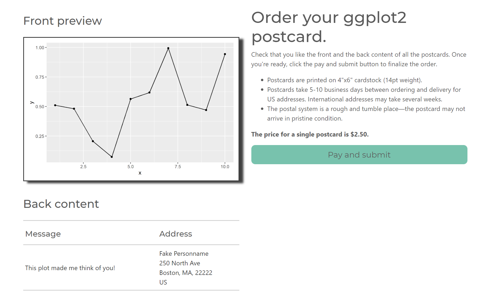
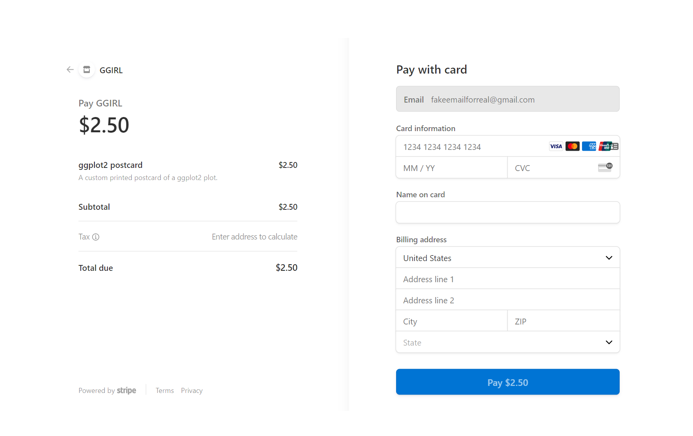

# ggirl - make ggplots in real life 

_need support? Email [support@ggirl.art](mailto:support@ggirl.art)_

This package is a platform for taking ggplot2 objects and getting real life versions of them. Tired of saving your plots with the plain 'ol `ggsave()` function? Try this package instead!

The mediums in this package that you can choose from will change over time. Currently available are [ggwatercolor()](#ggwatercolor), [ggartprint()](#ggartprint), and [ggpostcard()](#ggpostcard).

## ggwatercolor

_**Availability:** United States_

ORIGINAL GGPLOT2 PLOT             |  A REAL LIFE WATERCOLOR
:-------------------------:|:-------------------------:
  | 


With `ggwatercolor()` you have a hand-painted watercolor painting of your ggplot2. These paintings are done
on heavy cold-pressed 8"x10" watercolor paper with lightfast paints, meaning your beautiful watercolor will withstand
the test of time.

### How to request a watercolor commission

First, install the package with:

```r
# install.packages("remotes") # if you don't already have it
remotes::install_github("jnolis/ggirl")
```

Then create a plot you like:

```r
library(ggplot2)
plot <- ggplot(data.frame(x=1:10, y=runif(10)),aes(x=x,y=y)) +
  geom_line() + geom_point() + theme_gray(48)
```

Then to request the commission! The `ggwatercolor()` function can be called to do so. Just specify the plot,
the orientation, a contact email, and the address to mail the commission to.

```r
library(ggirl)
delivery_address <- address(name = "Fake person", address_line_1 = "101 12th st",
address_line_2 = "Apt 17", city = "Seattle", state = "WA",
  postal_code = "98102", country = "US")
contact_email = "fakeemail275@gmail.com"
ggartprint(plot, orientation = "landscape", contact_email = contact_email, address = delivery_address)
```

This will open a web page to preview the watercolor. If you like it, you can request the commission, and in a
few days you'll get an email with details about the commission and request for payment.


The email will include the price, between \$100-\$175 depending on the complexity of the picture, and a link to pay. If the plot is complex it may also need to be simplified by the artist. After payment, the commission should be complete in up to 4 weeks.


## ggartprint

_**Availability:** United States_


_From left to right: [ggartprint_example_map](#open-street-map-plot) plot, [Palmer Penguin](https://github.com/allisonhorst/palmerpenguins) data, and ggplot2 art by [@ijeamakaanyene](https://github.com/Ijeamakaanyene)._

With `ggartprint()` you can order a beautiful art print to be mailed to you! The prints are on archival photo-rag paper and come in a number of sizes from "cute and small" to "large and centerpiece of a room"

|Size (inches)  |Price (includes shipping)  |
|:-----|:------|
|11x14 |$30.00 |
|16x20 |$40.00 |
|18x24 |$50.00 |
|24x36 |$75.00 |
|12x12 |$30.00 |
|16x16 |$35.00 |
|20x20 |$45.00 |

### How to make an art print

First, install the package with:

```r
# install.packages("remotes") # if you don't already have it
remotes::install_github("jnolis/ggirl")
```

Then create a plot you like:

```r
library(ggplot2)
plot <- ggplot(data.frame(x=1:10, y=runif(10)),aes(x=x,y=y)) +
  geom_line() + geom_point() + theme_gray(48)
```

Now let's order the prints! You'll need to specify your email address and the physical address to mail to. You'll also need to specify the size (ex: "11x14"), the orientation (ex: "portrait"), and quantity (typically 1).

```r
library(ggirl)
delivery_address <- address(name = "Fake person", address_line_1 = "101 12th st",
address_line_2 = "Apt 17", city = "Seattle", state = "WA",
  postal_code = "98102", country = "US")
contact_email = "fakeemail275@gmail.com"
ggartprint(plot, size="24x36", orientation = "landscape", quantity = 1,
           contact_email = contact_email, address = delivery_address)
```

This will open a web page to preview the art print. if you like how it looks you can submit the order and pay via Stripe.


And you're done! Art prints will arrive in around 2-3 weeks.

### Examples for if you can't think of a cool art print plot 

#### Open Street Map plot

Try making a map! With `ggartprint_example_map()` you can make a map that would cost you twice as much from a non-R based tool. This uses the `osmdata` package to get data from Open Street Maps, and is based on a tutorial by [Joshua McCrain](http://joshuamccrain.com/tutorials/maps/streets_tutorial.html).

```r
library(ggirl)
contact_email <- "fakeemailforreal@gmail.com"
delivery_address <- address(name = "Fake Personname", address_line_1 = "250 North Ave",
                          city = "Boston", state = "MA",
                          postal_code = "22222", country = "US")
plot <- ggartprint_example_map("Seattle", "Washington")
# use the background option to avoid white boundaries
ggartprint(plot, background = "#FEFDF7", size = "11x14", orientation = "portrait",
                                contact_email = contact_email,
                                address = delivery_address))
```


## ggpostcard

_**Availability:** United States (international coming soon!)_

`ggpostcard()` will take your ggplot2 object and _**will mail a postcard with it to the address of your choice!**_ Great for friends and colleagues (or maybe holiday cards??). You can specify a single address or many addresses to mail to, and you can customize the message on the back. If you send postcards to many people, you can customize the backs for each recipient if you so chose. _Each postcard costs $2.50 to send._

ORIGINAL GGPLOT2 PLOT             |  A REAL LIFE POSTCARD
:-------------------------:|:-------------------------:
  | 


### How to make a postcard

First, install the package with:

```r
# install.packages("remotes") # if you don't already have it
remotes::install_github("jnolis/ggirl")
```

Then create a plot you like:

```r
library(ggplot2)
plot <- ggplot(data.frame(x=1:10, y=runif(10)),aes(x=x,y=y)) + geom_line() + geom_point()
```

Now let's ship it! Specify your email address (for order updates), address to mail to, and the message to put on the back:

```r
library(ggirl)
contact_email <- "fakeemailforreal@gmail.com"

send_address_1 <- address(name = "Fake Personname", address_line_1 = "250 North Ave",
                          city = "Boston", state = "MA",
                          postal_code = "22222", country = "US")

message_1 <- "This plot made me think of you!"

ggpostcard(plot, contact_email, messages = message_1, send_addresses = send_address_1)
```

_(You can include multiple recipients too and customize the return address--check out the function help for more details.)_

This will pop up a web page showing you what the order will look like. If both the front picture and back info look good to you click the button to make the payment and submit the order.



This will bring you to Stripe to finish the purchase.



And you're done! Postcards will arrive in around 1-2 weeks.

### Examples for if you can't think of a cool postcard plot 

Included in ggirl::ggpostcard functionality are a few plots that are ready for you to try!

#### Sunrise/sunset plot

You can use `ggirl::ggpostcard_example_sunrise()` to make a postcard of sunrise and sunset locations for a city. It defaults to Seattle, WA, but you can use any location (check the documentation for requirements). It takes a minute or so to query the [sunrise/sunset api](https://sunrise-sunset.org/api):


```r
library(ggirl)
contact_email <- "fakeemailforreal@gmail.com"
send_addresses <- address(name = "Fake Personname", address_line_1 = "250 North Ave",
                          city = "Boston", state = "MA",
                          postal_code = "22222", country = "US")
messages <- "Look at this cool plot I found!"

plot <- ggpostcard_example_sunrise()
ggpostcard(plot = plot,
           contact_email = contact_email,
           send_addresses = send_addresses, messages = messages)
```

#### ContouR plot

You can use `ggirl::ggpostcard_example_contouR()` to make a postcard of the generative art of [@Ijeamakaanyene](https://github.com/Ijeamakaanyene). Check the help function on how to change the colors of the plot.


```r
library(ggirl)
contact_email <- "fakeemailforreal@gmail.com"
send_addresses <- address(name = "Fake Personname", address_line_1 = "250 North Ave",
                          city = "Boston", state = "MA",
                          postal_code = "22222", country = "US")
messages <- "Look at this cool plot I found!"

plot <- ggpostcard_example_contouR()
ggpostcard(plot = plot,
           contact_email = contact_email,
           send_addresses = send_addresses, messages = messages)
```

#### rstereogram plot

You can use `ggirl::ggpostcard_example_rstereogram()` to make a postcard of a stereogram of an image using the rstereogram package by [@ryantimpe](https://github.com/ryantimpe). It defaults to the R logo but you can pass it any PNG file. Check the documentation for best practices around that, and if you're having trouble seeing the image you may need to zoom in on your monitor.


```r
library(ggirl)
contact_email <- "fakeemailforreal@gmail.com"
send_addresses <- address(name = "Fake Personname", address_line_1 = "250 North Ave",
                          city = "Boston", state = "MA",
                          postal_code = "22222", country = "US")
messages <- "Look at this cool plot I found!"

plot <- ggpostcard_example_rstereogram()
ggpostcard(plot = plot,
           contact_email = contact_email,
           send_addresses = send_addresses, messages = messages)
```


## Get involved

If you think this package is interesting you can help in multiple ways! Maybe you have an R package that could call one of these functions! Maybe you could come up with a new form of fulfillment, like making plots out of clay! Email info@ggirl.art to discuss it.

## Acknowledgments

Thanks to:

* [@nolistic](https://github.com/nolistic) and [@robinsones](https://github.com/robinsones) for helping design the product.
* The ggpostcard beta testers: [@cxinya](https://github.com/cxinya), [@delabj](https://github.com/delabj), [@thisisnic](https://github.com/thisisnic), [@TheCoachEdwards](https://github.com/TheCoachEdwards), [@ryantimpe](https://github.com/ryantimpe), [@robinsones](https://github.com/robinsones), [@mcsiple](https://github.com/mcsiple), and [@cathblatter](https://github.com/cathblatter).
* [@ColinFay](https://github.com/ColinFay) for the package [{brochure}](https://github.com/ColinFay/brochure) which powers the Shiny server doing the back-end work.
* [@Ijeamakaanyene](https://github.com/Ijeamakaanyene) for the use of the contouR example and beta testing ggartprint.
* [@ryantimpe](https://github.com/ryantimpe) for the use of the rstereogram example.
* [sunrise-sunset.org](https://sunrise-sunset.org/) for the API powering the sunrise example.
* [Joshua McCrain](http://joshuamccrain.com/tutorials/maps/streets_tutorial.html) for the tutorial used for the map example.
* [The R Foundation](https://www.r-project.org/logo/) for the R logo in the ggpostcard_example_rstereogram().
